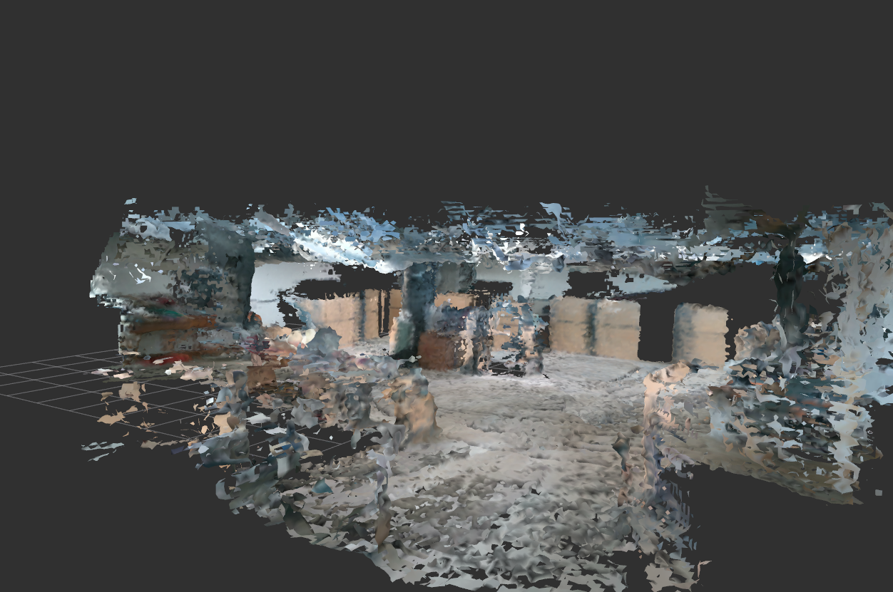

# Voxblox


This is a slighly modified version of the original Voxblox repository to make it work with Ros Noetic on Ubuntu 20.04. I have not tested it on other systems so I am not sure whether it would work there.

To get more information on Voxblox, please refer to the original [Voxblox](https://github.com/ethz-asl/voxblox) repo

# Documentation
- All voxblox documentation can be found on [the original readthedocs page](https://voxblox.readthedocs.io/en/latest/index.html)

## Installation
All the actual installation instructions can be found in the original documentation as well, this just tells how to run it with RRC setup

If you don't have a catkin workspace yet, set it up as follows:
```
mkdir -p ~/catkin_ws/src
cd ~/catkin_ws
catkin init
```
Compile
```
cd ~/catkin_ws/src/
git clone
catkin build voxblox_ros
```

## Running on RRC rosbag

### Sample Results from RRC
A video showing sample output from voxblox on RRC can be seen [here](https://youtu.be/Q02Q0XH9yEs). The rosbag was recorded using realsense D34 kept on a P3DX mobile robot.

